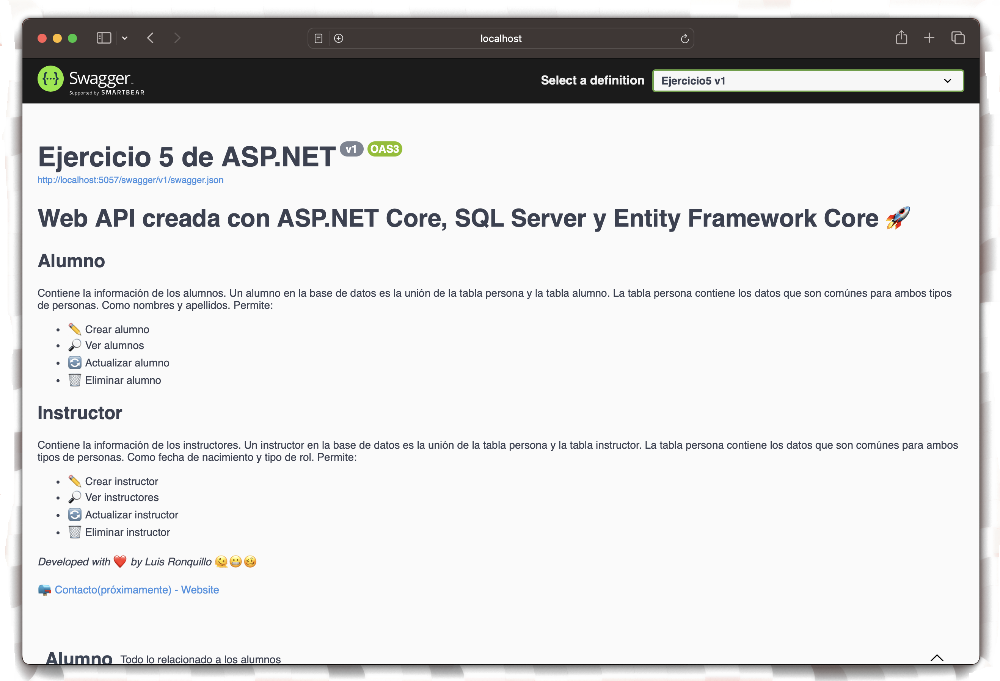
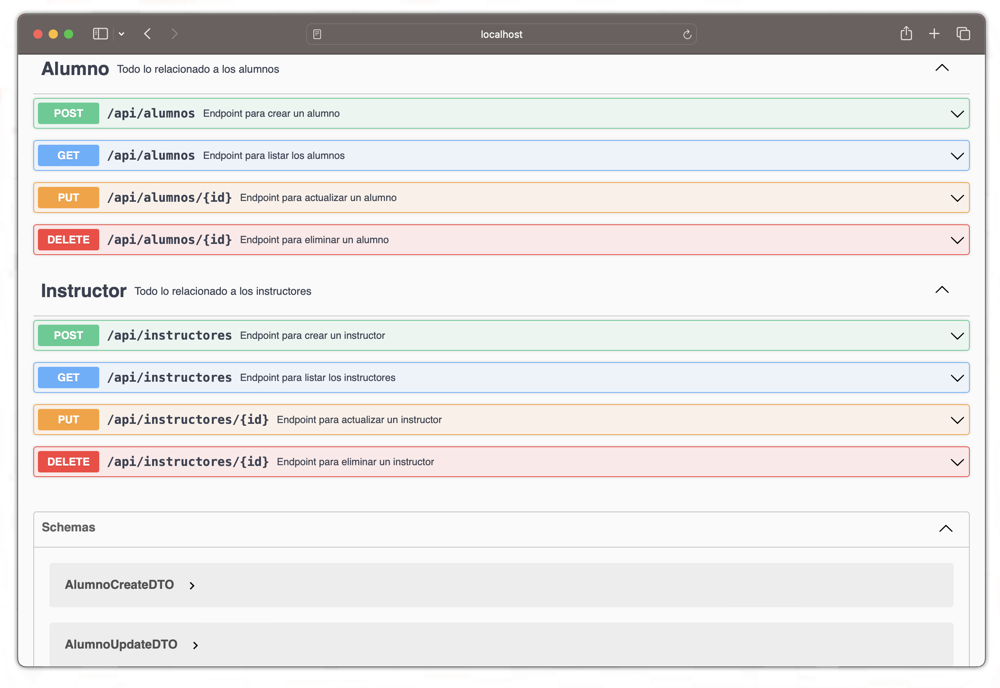

# CRUD con ASP.NET Core Web API y SQLServer
Esta es una Web API de prueba creada con ASP.NET Core, SQL Server y Entity Framework Core. Permite visualizar, crear, actualizar y eliminar alumnos e instructores. La aplicación puede encriptar y desencriptar datos con el algoritmo AES. 



Este es un test sencillo de una Web API para un CRUD en ASP.NET Core y usando Microsoft SQL Server 2022 para la base de datos.
El software fue desarrollado en Jetbrains Rider, Microsoft SQL Server 2022 en Docker(2022-latest) y Azure Data Studio. Sistema Operativo: Mac OS Ventura 13.6.

**Alumnos** es la unión entre la tabla `alumno` y `persona`. **Instructores** es la unión entre la tabla `instructor` y `persona`.
La tabla `persona` contiene los datos comunes para una persona, como sus nombres y apellidos.



<details>
<summary>Dependencias</summary>
  Se requiere de las siguientes dependencias:
  
  - Microsoft.AspNetCore.OpenApi
  - Microsoft.EntityFrameworkCore.Tools
  - Swashbuckle.AspNetCore.Annotations
  - Swashbuckle.AspNetCore
</details>

<details>
  <summary>Base de datos</summary>
  
  Los datos iniciales de la base de datos son incluidos en el script. El primer nombre de cada persona está ya encriptado.
  
  ```sql
  CREATE DATABASE practica_CSharp;
-- LOS DATOS EN ESTA BASE DE DATOS SON FICTICIOS. CUALQUIER PARECIDO CON LA REALIDAD ES MERA COINCIDENCIA.
USE practica_CSharp;

-- Creación de las tablas (sin cambios)
CREATE TABLE persona (
    id_persona INT IDENTITY(1,1) NOT NULL PRIMARY KEY,
    nombre_uno NVARCHAR(64),
    nombre_dos NVARCHAR(64) NULL,
    apellido_uno NVARCHAR(64),
    apellido_dos NVARCHAR(64) NULL,
    D_nacimiento DATE,
    tipo_rol NVARCHAR(64)
);

CREATE TABLE alumno (
    id_persona INT NOT NULL PRIMARY KEY,
    matricula NVARCHAR(64),
	carrera NVARCHAR(64),
    semestre NVARCHAR(64),
    especialidad NVARCHAR(64) NULL
);

CREATE TABLE instructor (
    id_persona INT NOT NULL PRIMARY KEY,
    folio NVARCHAR(64) -- Verifica si necesitas cambiar esto a id_persona
);

CREATE TABLE reunion (
    id_reunion INT IDENTITY(1,1) NOT NULL PRIMARY KEY,
    fecha DATE,
    hora TIME,
    lugar NVARCHAR(100),
    tema NVARCHAR(200)
);

CREATE TABLE alumno_reunion (
    id_alumno INT NOT NULL,
    id_reunion INT NOT NULL,
    PRIMARY KEY (id_alumno, id_reunion)
);

CREATE TABLE instructor_reunion (
    id_instructor INT NOT NULL,
    id_reunion INT NOT NULL,
    PRIMARY KEY (id_instructor, id_reunion)
);

-- Creación de las relaciones (con correcciones)
ALTER TABLE alumno
ADD CONSTRAINT FK_Alumno_Persona
FOREIGN KEY (id_persona) REFERENCES persona(id_persona)
ON DELETE CASCADE;

ALTER TABLE instructor
ADD CONSTRAINT FK_Instructor_Persona
FOREIGN KEY (id_persona) REFERENCES persona(id_persona)
ON DELETE CASCADE;

ALTER TABLE alumno_reunion
ADD CONSTRAINT FK1_Alumno_Reunion
FOREIGN KEY (id_alumno) REFERENCES alumno(id_persona)
ON DELETE CASCADE;

ALTER TABLE alumno_reunion
ADD CONSTRAINT FK2_Alumno_Reunion
FOREIGN KEY (id_reunion) REFERENCES reunion(id_reunion);

ALTER TABLE instructor_reunion
ADD CONSTRAINT FK1_Instructor_Reunion
FOREIGN KEY (id_instructor) REFERENCES instructor(id_persona)
ON DELETE CASCADE;

ALTER TABLE instructor_reunion
ADD CONSTRAINT FK2_Instructor_Reunion
FOREIGN KEY (id_reunion) REFERENCES reunion(id_reunion);

-- INSERTAR DATOS DE ALUMNOS E INSTRUCTORES
/*
En MySQL podemos ingresar manualmente el ID, pero no en SQL Server debido a "IDENTITY(1,1)". Debido a esto, los datos iniciales de la tabla se deben ingrersar con los siguientes comandos, ejecutando uno por uno
dichos comandos. Una vez y las tablas tengan datos iniciales, se crean Store Procedures para hacer la insercción de nuevos datos de forma autómatica para mantener la integridad de los datos.
Esto debido al diseño de la base de datos pues, la tabla persona contiene los datos que son comunes para instructores y alumnos(como sus nombres).
*/

-- DATO 1

BEGIN TRANSACTION;

INSERT INTO persona (nombre_uno, nombre_dos, apellido_uno, apellido_dos, D_nacimiento, tipo_rol) VALUES
('k7iNjYFVu6mt5Jf+nVGwvg==', 'Carlos', 'Pérez', 'García', '1995-05-15', 'Instructor');

DECLARE @NuevoId INT;
SET @NuevoId = SCOPE_IDENTITY();

INSERT INTO instructor (id_persona, folio) VALUES (
@NuevoId, 'F101');
COMMIT;

-- DATO 2

BEGIN TRANSACTION;

INSERT INTO persona (nombre_uno, nombre_dos, apellido_uno, apellido_dos, D_nacimiento, tipo_rol) VALUES
('1swJKrpvzZcb3B3fcLbg2A==', 'Alejandra', 'Rodríguez', 'Sánchez', '1998-08-22', 'Alumno');

DECLARE @NuevoId INT;
SET @NuevoId = SCOPE_IDENTITY();

INSERT INTO alumno (id_persona, matricula, carrera, semestre, especialidad) VALUES (
@NuevoId, 'A12345', 'Ingeniería Civil', '3', '');
COMMIT;

-- DATO 3

BEGIN TRANSACTION;

INSERT INTO persona (nombre_uno, nombre_dos, apellido_uno, apellido_dos, D_nacimiento, tipo_rol) VALUES
('4AN0uNundqhxCi8Pn13NCg==', 'Manuel', 'González', 'López', '1993-11-10', 'Instructor');

DECLARE @NuevoId INT;
SET @NuevoId = SCOPE_IDENTITY();

INSERT INTO instructor (id_persona, folio) VALUES (
@NuevoId, 'G202');
COMMIT;

-- DATO 4

BEGIN TRANSACTION;

INSERT INTO persona (nombre_uno, nombre_dos, apellido_uno, apellido_dos, D_nacimiento, tipo_rol) VALUES
('0MmFfGOS256RkWOfJHjUVg==', 'Victoria', 'Martínez', 'Fernández', '1997-03-04', 'Alumno');

DECLARE @NuevoId INT;
SET @NuevoId = SCOPE_IDENTITY();

INSERT INTO alumno (id_persona, matricula, carrera, semestre, especialidad) VALUES (
@NuevoId, 'B67890', 'Medicina', '2', '');
COMMIT;

-- DATO 5

BEGIN TRANSACTION;

INSERT INTO persona (nombre_uno, nombre_dos, apellido_uno, apellido_dos, D_nacimiento, tipo_rol) VALUES
('34xighgAZkyEdRig/geDHQ==', NULL, 'Torres', NULL, '1994-09-20', 'Instructor');

DECLARE @NuevoId INT;
SET @NuevoId = SCOPE_IDENTITY();

INSERT INTO instructor (id_persona, folio) VALUES (
@NuevoId, 'H303');
COMMIT;

-- DATO 6

BEGIN TRANSACTION;

INSERT INTO persona (nombre_uno, nombre_dos, apellido_uno, apellido_dos, D_nacimiento, tipo_rol) VALUES
('nMeckhE+7+6JD0Dyfd7u5Q==', 'Isabel', 'Díaz', 'García', '2000-01-12', 'Alumno');

DECLARE @NuevoId INT;
SET @NuevoId = SCOPE_IDENTITY();

INSERT INTO alumno (id_persona, matricula, carrera, semestre, especialidad) VALUES (
@NuevoId, 'C54321', 'Derecho', '4', '');
COMMIT;

-- DATO 7

BEGIN TRANSACTION;

INSERT INTO persona (nombre_uno, nombre_dos, apellido_uno, apellido_dos, D_nacimiento, tipo_rol) VALUES
('/K4rkCINQxQbswhfvNoQzg==', 'Alejandro', 'Ramírez', 'Rodríguez', '1996-07-08', 'Instructor');

DECLARE @NuevoId INT;
SET @NuevoId = SCOPE_IDENTITY();

INSERT INTO instructor (id_persona, folio) VALUES (
@NuevoId, 'I404');
COMMIT;

-- DATO 8

BEGIN TRANSACTION;

INSERT INTO persona (nombre_uno, nombre_dos, apellido_uno, apellido_dos, D_nacimiento, tipo_rol) VALUES
('FEBThewbhVO4sQaBx8QmSw==', NULL, 'Sánchez', NULL, '1999-12-28', 'Alumno');

DECLARE @NuevoId INT;
SET @NuevoId = SCOPE_IDENTITY();

INSERT INTO alumno (id_persona, matricula, carrera, semestre, especialidad) VALUES (
@NuevoId, 'D98765', 'Economía', '5', '');
COMMIT;

-- DATO 9

BEGIN TRANSACTION;

INSERT INTO persona (nombre_uno, nombre_dos, apellido_uno, apellido_dos, D_nacimiento, tipo_rol) VALUES
('r0awFjRE+cyISZR1hM+Wtg==', NULL, 'Pérez', NULL, '1992-06-25', 'Instructor');

DECLARE @NuevoId INT;
SET @NuevoId = SCOPE_IDENTITY();

INSERT INTO instructor (id_persona, folio) VALUES (
@NuevoId, 'J505');
COMMIT;

-- DATO 10

BEGIN TRANSACTION;

INSERT INTO persona (nombre_uno, nombre_dos, apellido_uno, apellido_dos, D_nacimiento, tipo_rol) VALUES
('7XknG8+W5LqG7JN6NhSQLw==', 'Mariana', 'García', 'Rodríguez', '1998-04-18', 'Alumno');

DECLARE @NuevoId INT;
SET @NuevoId = SCOPE_IDENTITY();

INSERT INTO alumno (id_persona, matricula, carrera, semestre, especialidad) VALUES (
@NuevoId, 'E23456', 'Psicología', '2', '');
COMMIT;

-- INSERCCIÓN DE DATOS DE REUNIONES

INSERT INTO reunion (fecha, hora, lugar, tema) VALUES
('2023-08-20', '15:00:00', 'Sala A', 'Presentación Curso'),
('2023-08-25', '14:30:00', 'Auditorio B', 'Evaluación Parcial'),
('2023-09-05', '17:00:00', 'Salón C', 'Discusión Proyecto'),
('2023-09-10', '16:15:00', 'Aula D', 'Taller de Debate'),
('2023-09-15', '18:30:00', 'Patio Principal', 'Conferencia Invitado'),
('2023-09-21', '10:00:00', 'Sala A', 'Evaluación Parcial'),
('2023-09-21', '13:00:00', 'Campus Este', 'Dual'),
('2023-09-22', '13:00:00', 'Campus Oeste', 'Dual');

INSERT INTO instructor_reunion (id_instructor, id_reunion) VALUES
(1, 1),
(3, 2),
(5, 3),
(7, 4),
(9, 5);

INSERT INTO alumno_reunion (id_alumno, id_reunion) VALUES
(2, 1),
(4, 2),
(6, 3),
(8, 4);

-- STORE PROCEDURES

CREATE PROCEDURE sp_GetAlumnos
AS
BEGIN
    SELECT p.id_persona, p.nombre_uno, p.nombre_dos, p.apellido_uno, p.apellido_dos, a.matricula, a.carrera, a.semestre, a.especialidad
    FROM persona p
    INNER JOIN alumno a ON p.id_persona = a.id_persona;
END;

CREATE PROCEDURE sp_GetInstructores
AS
BEGIN
    SELECT p.id_persona, p.nombre_uno, p.nombre_dos, p.apellido_uno, p.apellido_dos, p.D_nacimiento, i.folio
    FROM persona p
    INNER JOIN instructor i ON p.id_persona = i.id_persona;
END;

CREATE PROCEDURE sp_GetEventosAgendados
AS
BEGIN
    SELECT persona.id_persona, nombre_uno, nombre_dos, apellido_uno, apellido_dos, matricula, semestre, especialidad, reunion.id_reunion, tema, fecha, hora, lugar
	FROM persona, alumno, alumno_reunion, reunion
	WHERE alumno.id_persona = alumno_reunion.id_alumno AND alumno_reunion.id_reunion = reunion.id_reunion AND persona.id_persona = alumno.id_persona
END;

CREATE PROCEDURE sp_InsertarAlumno
	@Nombre1 NVARCHAR(64),
    @Nombre2 NVARCHAR(64),
    @Ap1 NVARCHAR(64),
    @Ap2 NVARCHAR(64),
    @DNacimiento DATE,
    @Matricula NVARCHAR(64),
    @Carrera NVARCHAR(64),
    @Semestre INT,
    @Especialidad NVARCHAR(64)
AS
BEGIN
	BEGIN TRANSACTION;
	INSERT INTO persona (nombre_uno, nombre_dos, apellido_uno, apellido_dos, D_nacimiento, tipo_rol) VALUES(@Nombre1, @Nombre2, @Ap1, @Ap2, @DNacimiento, 'Alumno');
	
	DECLARE @NuevoId INT;
	SET @NuevoId = SCOPE_IDENTITY();
	
	INSERT INTO alumno (id_persona, matricula, carrera, semestre, especialidad) VALUES (
	@NuevoId, @Matricula, @Carrera, @Semestre, @Especialidad);
	
	COMMIT;
END;

CREATE PROCEDURE sp_ObtenerIDAlumno
	@idPersona INT
	AS
	BEGIN
		SELECT persona.id_persona, nombre_uno, nombre_dos, apellido_uno, apellido_dos, D_nacimiento, matricula, carrera, semestre, especialidad
		FROM persona, alumno
		WHERE persona.id_persona = alumno.id_persona AND persona.id_persona = @idPersona;
END;

CREATE PROCEDURE sp_ActualizarAlumno
	@idPersona INT,
	@Nombre1 NVARCHAR(64),
    @Nombre2 NVARCHAR(64),
    @Ap1 NVARCHAR(64),
    @Ap2 NVARCHAR(64),
    @DNacimiento DATE,
    @Matricula NVARCHAR(64),
    @Carrera NVARCHAR(64),
    @Semestre INT,
    @Especialidad NVARCHAR(64)
AS
BEGIN
	BEGIN TRANSACTION;
	UPDATE persona SET nombre_uno = @Nombre1, nombre_dos = @Nombre2, apellido_uno = @Ap1, apellido_dos = @Ap2, D_nacimiento = @DNacimiento WHERE persona.id_persona = @idPersona;

	UPDATE alumno SET id_persona = @idPersona, matricula = @Matricula, carrera = @Carrera, semestre = @Semestre, especialidad = @Especialidad WHERE alumno.id_persona = @idPersona;
	
	COMMIT;
END;

CREATE PROCEDURE sp_EliminarAlumno
	@idPersona INT
AS
BEGIN
	DELETE FROM persona WHERE persona.id_persona = @idPersona;
END;
  ```
</details>

<details>
  <summary>Seguridad de los datos</summary>

  En este ejemplo de práctica, solo el primer nombre de la persona es encriptado.
  El algoritmo de encriptación usado es AES y la clase que se encarga de encriptar y desencriptar los datos es `Encriptacion.cs`. Así, en la base de datos aparecerá una cadena de símbolos, letras y números sin ningún sentido.
  Pero en el programa, esta cadena será leída y desencriptada usando la llave de encriptación asignada. Es importante que esta llave no sea modificada pues, sin ella, los datos no podrán desencriptarse.
</details>
